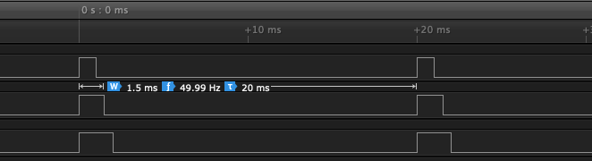

# mipea_servo

## a hardware servo library for the Raspberry Pi using the mipea library

This library makes it possible to control servos with the Raspberry Pi
without using much CPU power. It is **heavily inspired by** [richardghirst](https://github.com/richardghirst)'s [ServoBlaster](https://github.com/richardghirst/PiBits/tree/master/ServoBlaster).

### Advantages
* written purely in C
* easy to use C functions
* very compact (< 200 lines of code)
* very accurate:

* (nearly) no CPU usage (3 servos running in the picture below):

### Usage
You will first of all need to install [mipea](https://github.com/jasLogic/mipea), another library I wrote which grants the DMA (and physical memory) and PWM access.

Because there is no Makefile (yet) you will need to directly incorporate it into your project or build a library yourself.

1. Include the header file: `#include "servo.h"`.
2. You need to initialize the library, else there will be a segmentation fault: `servo_init();`
3. Use the `servo_add(uint32_t pin);` function to add as many servos as you want.
4. Use `servo_set(uint32_t pin, unsigned int pulsewidth);` to set the pulsewidth (in µs) of the servo on pin `pin`.
5. Use `servo_update_cbs(void);` to update the PWM pulse.
6. *(optional)* Remove a servo you do not need anymore: `servo_remove(uint32_t pin);`
7. It is also very important to uninit the library again, because else the peripherals stay mapped and the PWM pulse will keep running: `servo_uninit();`
8. Compile: `gcc -o [your program] program.c servo.c -lmipea`

### Functioning
First, in `servo_init();`, PWM is configured to trigger the DMA after 1µs
every time data is written to the FIFO.
Every time `servo_update_cbs(void);` is called the code block structure is set up
(for a visualization have a look at [diagram.txt](diagram.txt)).
We differentiate between "time keeping code blocks" (TKCB) and
"gpio code blocks" (GCP). The function allocates space for 20000 TKCB plus two GCB
for every servo (two turn on and off). The code block structure is set up
so that for every µs there is a TKCB. At the position where a servo needs to
be turned on or off a GCP is inserted. A GCP does *not* wait 1µs.

### Sources and Documentation
* [richardghirst](https://github.com/richardghirst)'s [ServoBlaster](https://github.com/richardghirst/PiBits/tree/master/ServoBlaster) where I took most of my inspiration
* [BCM2835 ARM Peripherals Datasheet](https://www.raspberrypi.org/app/uploads/2012/02/BCM2835-ARM-Peripherals.pdf)
* The [rpi-gpio-dma-demo](https://github.com/hzeller/rpi-gpio-dma-demo) helped me understand how DMA works
