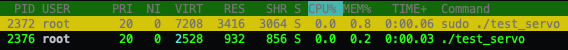

# mipea_servo

## a hardware servo library for the Raspberry Pi using the mipea library

This library makes it possible to control servos with the Raspberry Pi
without using the cpu. It is **heavily inspired by** [richardghirst](https://github.com/richardghirst)'s [ServoBlaster](https://github.com/richardghirst/PiBits/tree/master/ServoBlaster).

#### Advantages
* written purely in C
* easy to use C functions
* very compact (< 200 lines of code)
* very accurate:

* (nearly) no CPU usage

### Usage
You will first of all need to install [mipea](https://github.com/jasLogic/mipea), another library I wrote which grants the DMA (and physical memory) and PWM access.

Because there is no Makefile (yet) you will need to directly incorporate it into your project or build a library yourself.

1. Include the header file: `#include "servo.h"`.
2. You need to initialize the library, else there will be a segmentation fault: `servo_init();`
3. Use the `servo_add(uint32_t pin);` function to add as many servos as you want.
4. Use `servo_set(uint32_t pin, unsigned int pulsewidth);` to set the pulsewidth (in µs) of the servo on pin `pin`.
5. *(optional)* Remove a servo you do not need anymore: `servo_remove(uint32_t pin);`
6. It is also very important to uninit the library again, because else the peripherals stay mapped and the PWM pulse will keep running: `servo_uninit();`
7. Compile: `gcc -o [your program] program.c servo.c -lmipea`

### Sources and Documentation
* [richardghirst](https://github.com/richardghirst)'s [ServoBlaster](https://github.com/richardghirst/PiBits/tree/master/ServoBlaster) where I took most of my inspiration
* [BCM2835 ARM Peripherals Datasheet](https://www.raspberrypi.org/app/uploads/2012/02/BCM2835-ARM-Peripherals.pdf)
* The [rpi-gpio-dma-demo](https://github.com/hzeller/rpi-gpio-dma-demo) helped me understand how DMA works
